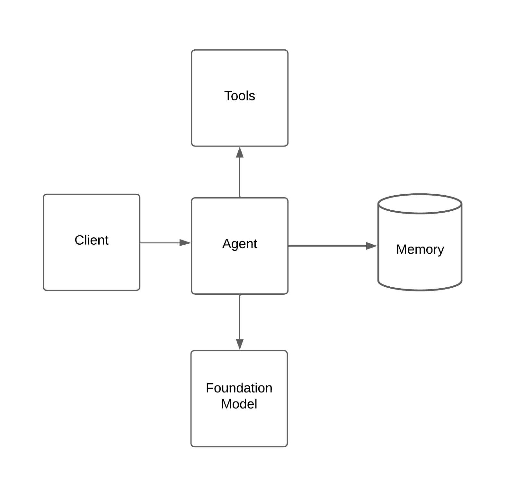

# 🧩 **Chapter 2: GenAI Application Architectures**

### 🎯 Learning Objectives:
By the end of this chapter, learners will be able to:
- Identify key architecture patterns for building GenAI apps
- Choose between stateless, serverless, microservice, RAG, and agentic models
- Evaluate trade-offs in terms of latency, cost, scalability, and complexity
- Deploy a GenAI application using one of these architectural patterns

---

### 📌 Topics Covered

#### 2.1 Key GenAI Architecture Patterns

| **Pattern**                        | **Description**                                                                 |
|-----------------------------------|---------------------------------------------------------------------------------|
| **Stateless GenAI API**           | Simple RESTful service calling an LLM per request                              |
| **Serverless Functions**          | Event-driven or request-based LLM calls using ephemeral compute                |
| **Microservice Architecture**     | Modular services handling generation, retrieval, and orchestration separately  |
| **Retrieval-Augmented Generation (RAG)** | Combines LLM with vector search over external documents             |
| **Agent-based Orchestration**     | Uses tools, memory, and planning for dynamic multi-step tasks                  |

---

### 🔍 Pattern 1: Stateless GenAI API


---
**Use Case:**  
- Simple chatbots  
- One-shot content generation (e.g., summaries, captions)  
- Marketing tools (e.g., slogan generator)

**Example:**  
```python
@app.route("/summarize", methods=["POST"])
def summarize():
    # Sends a new prompt each time with no memory
```

**Trade-offs:**  
✅ Easy to scale with load balancers  
❌ No memory or history across requests  
❌ Limits multi-step interactions

---

### 🔍 Pattern 2: Serverless GenAI Functions


---
**Use Case:**  
- Trigger-based summarizers (e.g., summarize Slack messages)  
- Event ingestion and transformation (e.g., form field completion)

**Example:**  
Deploy an Azure Function that summarizes an uploaded document when added to Blob Storage.

**Trade-offs:**  
✅ Low-cost when idle  
✅ Scalable for sporadic workloads  
❌ Cold start latency  
❌ Limited time for execution

---

### 🔍 Pattern 3: Microservices with Orchestration


---
**Use Case:**  
- Complex GenAI systems with reusable modules  
- Teams owning different LLM-driven services (retrieval, classification, generation)

**Trade-offs:**  
✅ Clear service boundaries  
✅ Easier to scale independently  
❌ Requires robust communication and monitoring  
❌ Higher operational complexity

---

### 🔍 Pattern 4: Retrieval-Augmented Generation (RAG)


**Use Case:**  
- Knowledge-based Q&A bots  
- Document copilots (contracts, policies, manuals)

**Example Flow:**
1. User asks: “What is our refund policy?”
2. System fetches relevant policy chunks from a vector store
3. Injects into LLM prompt and generates answer

**Tools:** Azure AI Search, Pinecone, FAISS, LangChain

**Trade-offs:**  
✅ Reduces hallucinations  
✅ Keeps answers up to date  
❌ Requires chunk tuning and vector relevance optimization  
❌ Context size limits still apply

---

### 🔍 Pattern 5: Agent-based Architectures

**Use Case:**  
- Research assistants  
- Travel planners, task solvers  
- Systems requiring reasoning and tool use (e.g., calculator, web search)



**Patterns:** ReAct, AutoGPT, LangGraph, Semantic Kernel Planner

**Example:**  
A GPT-4-based assistant that uses a calculator tool and a search tool to plan a trip and summarize top results.

**Trade-offs:**  
✅ Adaptive and interactive  
✅ Supports complex, multi-turn flows  
❌ Harder to debug  
❌ Higher cost due to multiple tool calls  
❌ Potential error propagation

---

### 📘 Suggested Resources

- [Azure Functions](https://learn.microsoft.com/en-us/azure/azure-functions/)
- [OpenAI + LangChain Patterns](https://docs.langchain.com/)
- [Semantic Kernel Architecture Guide](https://learn.microsoft.com/en-us/semantic-kernel/)
- [Microsoft AI Architecture Center](https://learn.microsoft.com/en-us/azure/architecture/example-scenario/ai/)

---

### ✅ Check Your Understanding

- When would you choose a RAG pattern over a stateless API?
- What are the pros and cons of serverless GenAI vs. microservice-based GenAI?
- How does an agent-based architecture differ from prompt chaining?

---